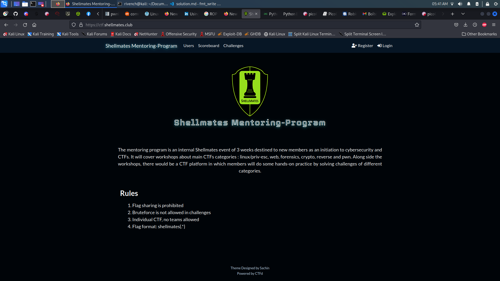

# Shellmates Mentoring Program 2k22 Write-Ups

Welcome to Shellmates Mentoring Program 2k22 Challenges' Write-Ups Repository, you can find all detailed solutions of each ctf's challenge.

## Introduction 

Mentoring program is an internal online event that Shellmates club offers as an opportunity to its dear members to introduce them into cybersecurity field by organizing beginner friendly and promising workshops in different cybersecurity categories accompanied with CTF challenges to practice on.

## Content

 - [Cryptography](./cryptography/)
 - [Forensics](./forensics/)
 - [General Skills](./general_skills/)
 - [Linux Priviliges Escalation](./linux-priv_esc/)
 - [Reverse Engineering](./reverse/)
 - [Web Client Exploitation](./web-client/)
 - [Web Server Exploitation](./web-server/)
 - [Binary Exploitation (PWN)](./pwn/)
