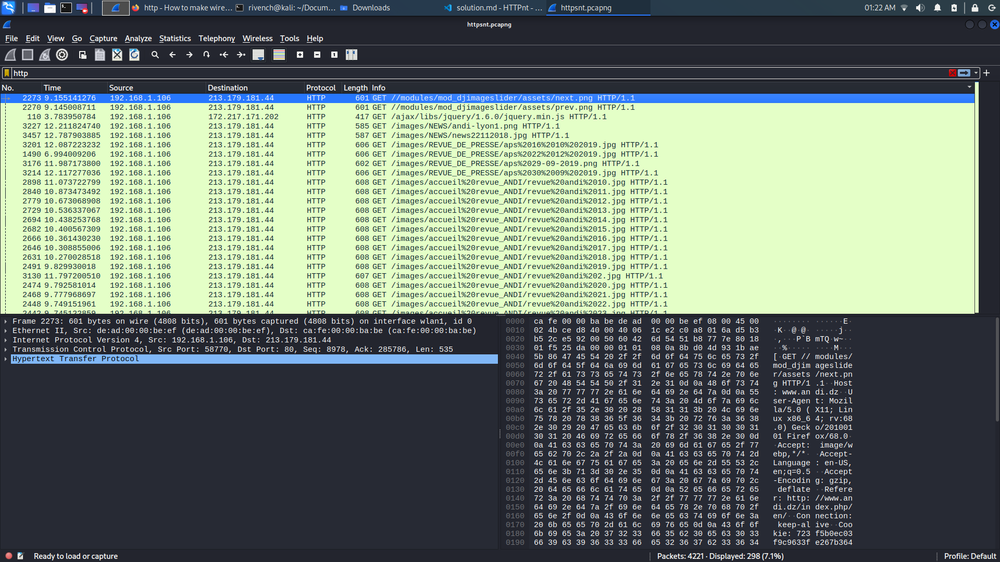
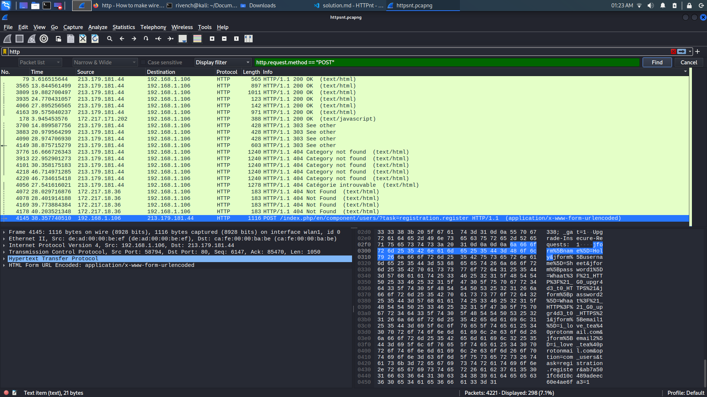
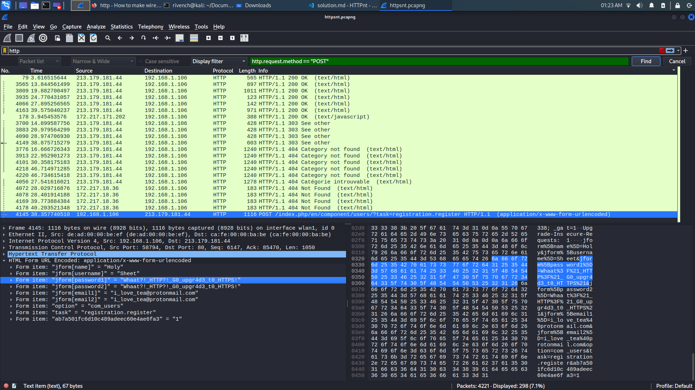

# HTTPSn't

## Description

> Recover the registration password from this capture session. Flag format : shellmates{password}

## Write-Up

from the given `httpsnt.pcapng`, we open it using wireshark (since it is a wireshark capture) :

```
wireshark httpsnt.pcapng
```

We can aftet that, filter on `http`.



And filter for `http.request.method == "POST"`



We can find easily the password in the `HTML Form` Field



## Flag

shellmates{Whaat?!_HTTP?!_G0_upgr4d3_t0_HTTPS!}


## More Information

 
