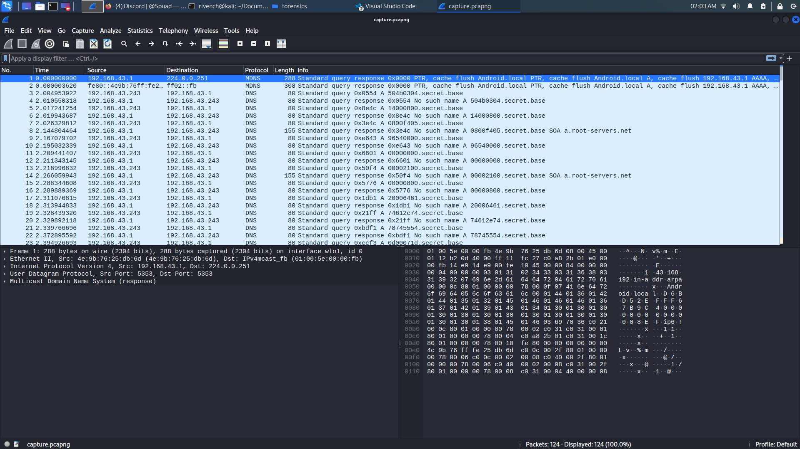
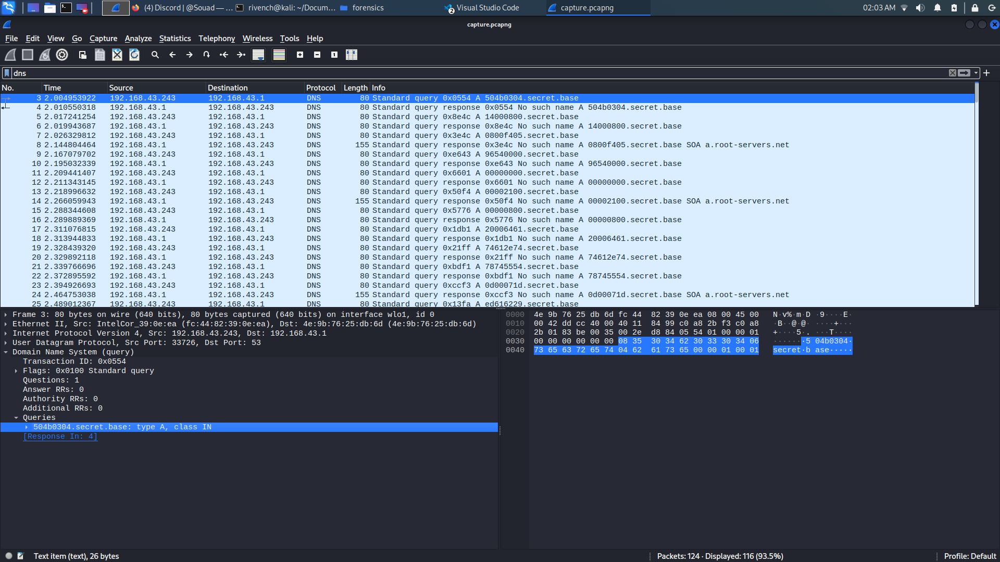

# agentDNS

## Description

> I think i'm being hacked, what did they manage to read ?? 

## Tags

medium

## Write-Up

from the given `capture.pcapng`, we open it using wireshark (since it is a wireshark capture) :

```
wireshark capture.pcapng
```




We can find the majority of the packages are from `dns` protocol, so let's filter on it :



We can see that each packet contains a domain name in the query that has a set of bytes in the last subdomain, and since there is a lot of them, we might think that they form a file, so let's recover them (check out `packets.json` file). We can do that from Wireshark GUI via following this path : `File > Export Packet Dissections > As JSON...`. You can choose `CSV` or any format you want.

From there, we can using a python script, read those json objects and extract those domain names :

```py
#! /usr/bin/python3


import json
  
# Opening JSON file
with open('packets.json') as j:
    j = open('packets.json')
  
# returns JSON object as 
# a dictionary
packets = json.load(j)
  
# Iterating through the json
# list
for packet in packets:
    print(list(packet["_source"]["layers"]["dns"]["Queries"].values())[0]["dns.qry.name"])
  
# Closing file
j.close()
```

```
504b0304.secret.base
504b0304.secret.base
14000800.secret.base
14000800.secret.base
0800f405.secret.base
0800f405.secret.base
96540000.secret.base
96540000.secret.base
00000000.secret.base
00000000.secret.base
00002100.secret.base
00002100.secret.base
00000800.secret.base
00000800.secret.base
20006461.secret.base
20006461.secret.base
74612e74.secret.base
74612e74.secret.base
78745554.secret.base
78745554.secret.base
0d00071d.secret.base
0d00071d.secret.base
ed616229.secret.base
ed616229.secret.base
ec61621d.secret.base
ec61621d.secret.base
ed616275.secret.base
ed616275.secret.base
780b0001.secret.base
780b0001.secret.base
04e80300.secret.base
04e80300.secret.base
0004e803.secret.base
0004e803.secret.base
00002bce.secret.base
00002bce.secret.base
48cdc9c9.secret.base
48cdc9c9.secret.base
4d2c492d.secret.base
4d2c492d.secret.base
ae76f153.secret.base
ae76f153.secret.base
894fad48.secret.base
894fad48.secret.base
33542c29.secret.base
33542c29.secret.base
3209c9cf.secret.base
3209c9cf.secret.base
37c8f737.secret.base
37c8f737.secret.base
28aae502.secret.base
28aae502.secret.base
00504b07.secret.base
00504b07.secret.base
08d2508e.secret.base
08d2508e.secret.base
f9230000.secret.base
f9230000.secret.base
00210000.secret.base
00210000.secret.base
00504b01.secret.base
00504b01.secret.base
02140314.secret.base
02140314.secret.base
00080008.secret.base
00080008.secret.base
00f40596.secret.base
00f40596.secret.base
54d2508e.secret.base
54d2508e.secret.base
f9230000.secret.base
f9230000.secret.base
00210000.secret.base
00210000.secret.base
00080020.secret.base
00080020.secret.base
00000000.secret.base
00000000.secret.base
00000000.secret.base
00000000.secret.base
00b48100.secret.base
00b48100.secret.base
00000064.secret.base
00000064.secret.base
6174612e.secret.base
6174612e.secret.base
74787455.secret.base
74787455.secret.base
540d0007.secret.base
540d0007.secret.base
1ded6162.secret.base
1ded6162.secret.base
29ec6162.secret.base
29ec6162.secret.base
1ded6162.secret.base
1ded6162.secret.base
75780b00.secret.base
75780b00.secret.base
0104e803.secret.base
0104e803.secret.base
000004e8.secret.base
000004e8.secret.base
03000050.secret.base
03000050.secret.base
4b050600.secret.base
4b050600.secret.base
00000001.secret.base
00000001.secret.base
00010056.secret.base
00010056.secret.base
00000079.secret.base
00000079.secret.base
00000000.secret.base
00000000.secret.base
00000000.secret.base
00000000.secret.base
```

After that, we extract sub domais :

```py
...
dns_subs = [dns_name.split(".")[0] for dns_name in dns_names]

print(dns_subs)
...
```

Finally, we write those in a file as ascii (Note that there is duplication, so we need to process that too) :


```py
with open('data', 'w') as g:
    for lis in dns_subs[::2]:
        g.write(lis)
        g.write('\n')
    print('Written in data.')
```

Then write them back as hexdump :

```
xxd -r -p data > data2
```

After that, when we check the new file `data2` type, find out that it is a `zip` file :

```
file data2
```

```
data2: Zip archive data, at least v2.0 to extract, compression method=deflate
```

After unziping it, we find a file that contains the flag :

```
└─$ unzip data2
```

```
Archive:  data2
  inflating: data.txt
```

```
cat data.txt
```

```
shellmates{DN$_exf1!tr4Too0oO0r}
```

## Flag

shellmates{DN$_exf1!tr4Too0oO0r}
