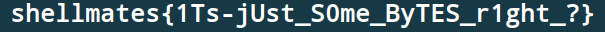

# bytes

## Description

> Somebody messed up with my bytes! I can't figure out how to fix them!!

## Write-Up

As we open the `bytes.txt` file, we can find a list of tuples where there is ints in the first part of each tuple, and bytes in the second part.

And as the description refers, we may deduce that those bytes are actually bytes from a file, while the ints are their order. So, let's create a small script that arranges that :

```py
#! /usr/bin/python3


# imp.write(b'aaaabcaab\x13\x12\x00\x00')

messedBytes = [(7621,0x9c), (3398,0x51), (2942,0xd9), (8547,0x78), (74,0x72), (3044,0x5), (1374,0x52), (6617,0xea), (7232,0xd5), (5103,0x9a), (6368,0x18), (7465,0x83), (3051,0xd3), (6322,0x93), (7950,0xaf), (8663,0xb0), (4326,0x3e), (1811,0x7c), (6384,0x87), (1207,0xce), (2000,0x6), (4299,0xfd), (6046,0x68), (1264,0x94), 

...

(8167,0xce), (8248,0x6f), (8729,0x44), (5900,0x1c), (6830,0xc6), (7454,0x5e), (1706,0x7b), (1674,0xa), (5893,0x8d), (3799,0xb7), (8657,0xd8), (2921,0x81), (4230,0xe8), (5333,0x94), (7019,0x7b), (780,0x41), (406,0xca), (7236,0x3b), (7638,0x57), (179,0x22), (7058,0xdf), (6611,0xa9), (6141,0x79), (1940,0x66), (5674,0x91), (3872,0xea), (6793,0x39), (8098,0xb0), (1775,0xdd), (7802,0xd0), (8500,0xb6), (4169,0x5c), (8333,0xe9), (36,0x4), (1354,0xc9), (6070,0x57)]


# print(sorted(messedBytes))

imp = open(f'flag', 'wb')

for i in sorted(messedBytes) :
    if i[1] > 0xf :
        imp.write(bytes.fromhex(str(hex(i[1]))[2:]))
    else :
        imp.write(bytes.fromhex('0' + str(hex(i[1]))[2:]))

imp.close()
```

So, in this script, we first sort back the tuples of bytes, then, we write each one in the `flag` file.

After executing the script, we get a `flag` files with bunch of bytes in it. the first thing to do is to check its type :

```
└─$ file flag
flag: PNG image data, 605 x 32, 8-bit/color RGBA, non-interlaced
```

So it is an image, so me might change its extension to display it :

```
└─$ mv flag flag.png
```

After openning it, it reveals the flag :



## Flag

shellmates{1Ts-jUst_S0me_ByTES_r1ght_?}

## More Information

 - Sorting a list of tuples : https://learnpython.com/blog/sort-tuples-in-python/
 - From hex to bytes in python : https://blog.finxter.com/how-to-convert-hex-string-to-bytes-in-python/