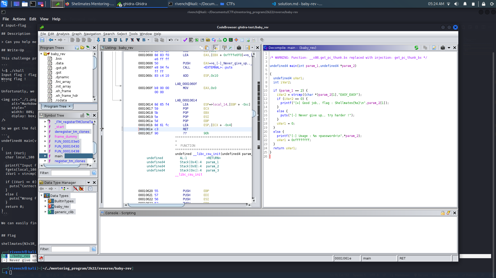

# baby-rev

## Description

> Only the worthy ones shall pass through my gate.
>
> Flag : shellmates{PASSWORD}
>
> **shellmates** and not **Shellmates**

## Write-Up

This challenge provides as an attachment a binary to execute. After executing his binary, we notice that it takes as an argument `<password>`, and verifies if it is actually the password or not :

```
└─$ ./baby_rev shellmates
[-] Never give up,, try harder !
```

Unfortunatly, we have no more information about this binary, so let's try to open it with `ghidra` and see what it hides :




So, we get the following code :

```c
/* WARNING: Function: __x86.get_pc_thunk.bx replaced with injection: get_pc_thunk_bx */

undefined4 main(int param_1,undefined4 *param_2)

{
  undefined4 uVar1;
  int iVar2;
  
  if (param_1 == 2) {
    iVar2 = strcmp((char *)param_2[1],"EASY_EASY");
    if (iVar2 == 0) {
      printf("[+] Good job,, flag : Shellmates{%s}\n",param_2[1]);
    }
    else {
      puts("[-] Never give up,, try harder !");
    }
    uVar1 = 0;
  }
  else {
    printf("[-] Usage : %s <password>\n",*param_2);
    uVar1 = 0xffffffff;
  }
  return uVar1;
}
```

As we can notice, the password taken is actually verified with a string `EASY_EASY` using `strcmp()` function, and if the comparaison returns true, then it is wrapped in the flag format and printed to the user.


## Flag

shellmates{EASY_EASY}
