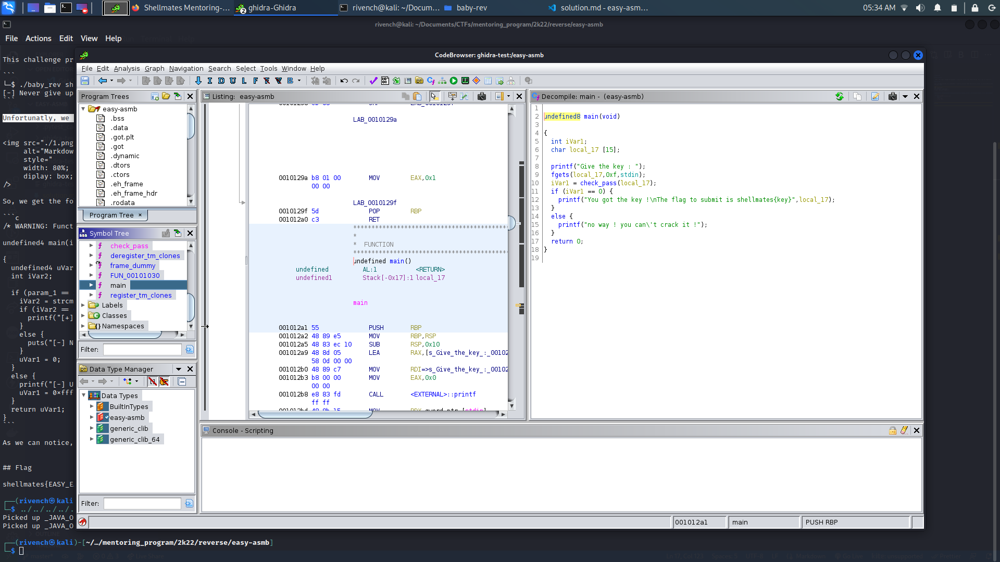

# easy-asmb

## Description

> Well, this time I changed the approach, I wrote the function that checks the key. See if you can reverse it.

## Write-Up

This challenge provides as an attachment a binary to execute. After executing his binary, we notice that it takes a key as an input, and verifies if it is actually the key or not:

```
└─$ ./easy-asmb
Give the key : shellmates
no way ! you can't crack it !
```

Unfortunatly, we have no more information about this binary, so let's try to open it with `ghidra` and see what it hides :



So, we get the following code :

```c
undefined8 main(void)

{
  int iVar1;
  char local_17 [15];
  
  printf("Give the key : ");
  fgets(local_17,0xf,stdin);
  iVar1 = check_pass(local_17);
  if (iVar1 == 0) {
    printf("You got the key !\nThe flag to submit is shellmates{key}",local_17);
  }
  else {
    printf("no way ! you can\'t crack it !");
  }
  return 0;
}
```

It seems like the input key is being verfied inside the `check_pass()` function, let's discover it content :

```c
undefined8 check_pass(char *param_1)

{
  undefined8 uVar1;
  
  if (((((*param_1 == 'A') && (param_1[1] == '5')) && (param_1[2] == 'd')) &&
      ((((param_1[3] == 'S' && (param_1[4] == '-')) &&
        ((param_1[5] == 'C' && ((param_1[6] == '2' && (param_1[7] == '2')))))) &&
       (param_1[8] == '1')))) &&
     ((((param_1[9] == '-' && (param_1[10] == 'a')) && (param_1[0xb] == 'v')) &&
      ((param_1[0xc] == '4' && (param_1[0xd] == 'x')))))) {
    uVar1 = 0;
  }
  else {
    uVar1 = 1;
  }
  return uVar1;
}
```

As we can see, this function makes tests on each character of our key, which gives us the opportinity to recover the key which is : `A5dS-C221-av4x`.

**Note :** note how `*param_1` represents the first value, since the pointer to the string is actually the pointer the first character of it


## Flag

shellmates{A5dS-C221-av4x}