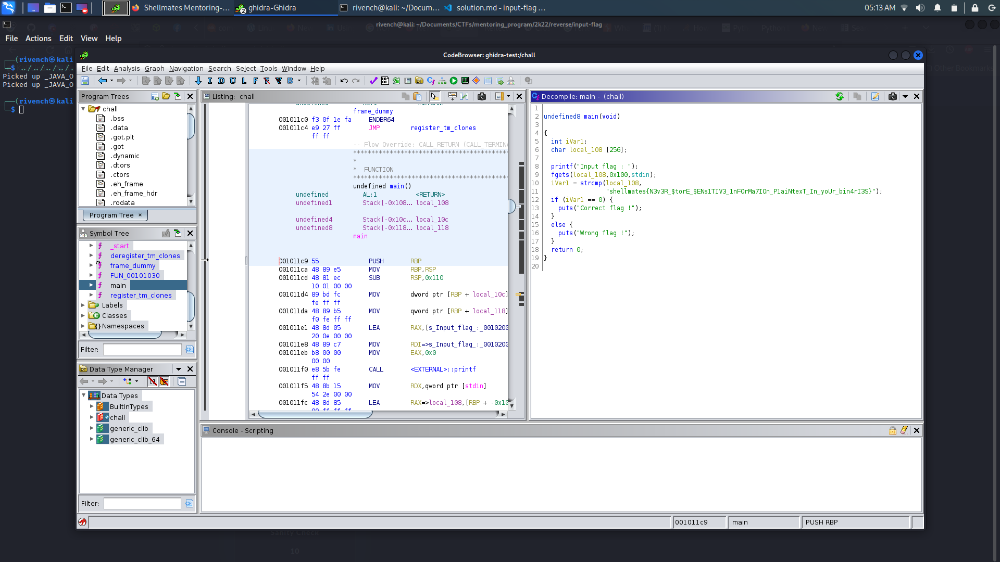

# input-flag

## Description

> Can you help me pass the right input to get the flag ?

## Write-Up

This challenge provides as an attachment a binary to execute. After executing his binary, we notice that it takes as an input, and verifies if it is actually the flag or not :

```
└─$ ./chall
Input flag : flag
Wrong flag !
```

Unfortunatly, we have no more information about this binary, so let's try to open it with `ghidra` and see what it hides :



So we get the following code :

```c
undefined8 main(void)

{
  int iVar1;
  char local_108 [256];
  
  printf("Input flag : ");
  fgets(local_108,0x100,stdin);
  iVar1 = strcmp(local_108,
                 "shellmates{N3v3R_$torE_$ENs1TIV3_1nFOrMa7IOn_P1aiNtexT_In_yoUr_bin4rI3S}");
  if (iVar1 == 0) {
    puts("Correct flag !");
  }
  else {
    puts("Wrong flag !");
  }
  return 0;
}
```

We can easily find that, the input is actually compared directly to the plaintext flag.


## Flag

shellmates{N3v3R_$torE_$ENs1TIV3_1nFOrMa7IOn_P1aiNtexT_In_yoUr_bin4rI3S}
