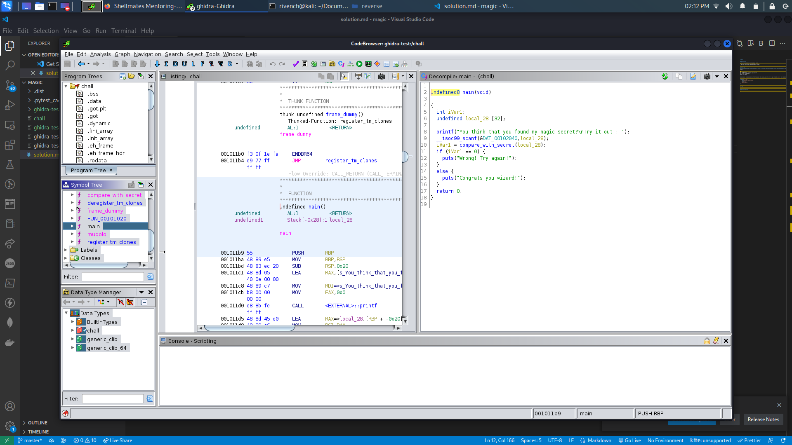

# magic

## Description

> Only true wizards can find my magic secret.
> 
> The flag looks like: shellmates{magic_secret}.


## Write-Up

This challenge provides as an attachment a binary to execute. After executing his binary, we notice that it takes an input, and verifies if it is actually the secret or not :

```
└─$ ./magic/chall
You think that you found my magic secret?
Try it out : shellmates
Wrong! Try again!
```

Unfortunatly, we have no more information about this binary, so let's try to open it with `ghidra` and see what it hides :




Here is the code we found :

```c
undefined8 main(void)

{
  int iVar1;
  undefined local_28 [32];
  
  printf("You think that you found my magic secret?\nTry it out : ");
  __isoc99_scanf(&DAT_00102040,local_28);
  iVar1 = compare_with_secret(local_28);
  if (iVar1 == 0) {
    puts("Wrong! Try again!");
  }
  else {
    puts("Congrats you wizard!");
  }
  return 0;
}
```

After changing some variables and types a bit, here is what we get :

```c
int main(void)

{
  int check;
  char secret [32];
  
  printf("You think that you found my magic secret?\nTry it out : ");
  __isoc99_scanf(&DAT_00102040,secret);
  check = compare_with_secret(secret);
  if (check == 0) {
    puts("Wrong! Try again!");
  }
  else {
    puts("Congrats you wizard!");
  }
  return 0;
}
```

As we can see, the `main` function contains a call for the `compare_with_secret` to check our secret if it is correct or not, so we might check for the `compare_with_secret` function : 

```c
bool compare_with_secret(void *param_1)

{
  int iVar1;
  char local_148 [271];
  byte local_39;
  undefined8 local_38;
  undefined8 local_30;
  undefined2 local_28;
  undefined local_26;
  FILE *local_18;
  char local_9;
  
  local_38 = 0x670b7112190a093a;
  local_30 = 0x193f202b3f0e1a1c;
  local_28 = 0x145;
  local_26 = 0;
  memset(local_148,0,0x100);
  readlink("/proc/self/exe",local_148,0xff);
  local_18 = fopen(local_148,"rb");
  for (local_9 = '\0'; local_9 < '\x12'; local_9 = local_9 + '\x01') {
    iVar1 = mudolo((int)local_9,4);
    fseek(local_18,(long)iVar1,0);
    fread(&local_39,1,1,local_18);
    *(byte *)((long)param_1 + (long)local_9) = local_39 ^ *(byte *)((long)param_1 + (long)local_9);
  }
  iVar1 = memcmp(&local_38,param_1,0x12);
  return iVar1 == 0;
}
```

After changing some variables and types a bit, here is what we get :

```c
bool compare_with_secret(char *secret)

{
  int iVar1;
  char local_148 [271];
  byte local_39;
  undefined8 local_38;
  undefined8 local_30;
  undefined2 local_28;
  undefined local_26;
  FILE *local_18;
  char local_9;
  
  local_38 = 0x670b7112190a093a;
  local_30 = 0x193f202b3f0e1a1c;
  local_28 = 0x145;
  local_26 = 0;
  memset(local_148,0,0x100);
  readlink("/proc/self/exe",local_148,0xff);
  local_18 = fopen(local_148,"rb");
  for (local_9 = '\0'; local_9 < '\x12'; local_9 = local_9 + '\x01') {
    iVar1 = mudolo((int)local_9,4);
    fseek(local_18,(long)iVar1,0);
    fread(&local_39,1,1,local_18);
    secret[local_9] = local_39 ^ secret[local_9];
  }
  iVar1 = memcmp(&local_38,secret,0x12);
  return iVar1 == 0;
}
```

In this function, when we check closer, we can see that our secret is being xored to some `local_39`, which is read from a file :

```c
...
    fread(&local_39,1,1,local_18);
    secret[local_9] = local_39 ^ secret[local_9];
...
```

And to be more precise, this operation goes for `\x12` iteration, so, we can deduce that our secret key length is `\x12`, which is **18 chars or bytes long** :

```c
...
  for (local_9 = '\0'; local_9 < '\x12'; local_9 = local_9 + '\x01') {
     ...
  }
```

Also, to know which characters are read from the file, let's check this two instructions :

```c
...
    iVar1 = mudolo((int)local_9,4);
    fseek(local_18,(long)iVar1,0);
...
```

As we can see, each time the pointer to the file is being set to the `iVal1`, which is the result of a `mudolo` function :

```c
ulong mudolo(int param_1,int param_2)

{
  return (long)param_1 % (long)param_2 & 0xffffffff;
}
```

This function is no more than a modulus function, which in our case returns the modulus of the iteration variable by 4. To understand more what's going on with that function, let's try it out :

```c
// Online C compiler to run C program online
#include <stdio.h>

long mudolo(int param_1,int param_2)

{
  return (long)param_1 % (long)param_2 & 0xffffffff;
}

int main() {
    int iVar1;
    char local_9;
    for (local_9 = '\0'; local_9 < '\x12'; local_9 = local_9 + '\x01') {
        iVar1 = mudolo((int)local_9,4);
        printf("%d ", iVar1);
    }

    return 0;
}
```

result :

```
0 1 2 3 0 1 2 3 0 1 2 3 0 1 2 3 0 1
```

So, from this result, we can deduce that from the imported file, only the 4 first bytes of the file are being read in a modulus motion for 18 chars long, where is char is being xor the our secret (input) and then verified using the following instruction :

```c
...
  iVar1 = memcmp(&local_38,secret,0x12);
...
```

As we know from the C library function `memcmp()` :

<br>

> `int memcmp(const void *str1, const void *str2, size_t n))`, it compares the first n bytes of memory area str1 and memory area str2. 

<br>

So, we need to do further more adjustments to the `compare_with_secret` funcion which is changing local_38 type to char[0x12] (note the `0x12` which is the same length taken from third parameter, we know that secret surpasses that length, so we need the `local_38` to do so as well):

```c
/* WARNING: Could not reconcile some variable overlaps */

bool compare_with_secret(char *secret)

{
  int iVar1;
  FILE *__stream;
  char local_148 [271];
  byte local_39;
  char local_38 [18];
  char local_9;
  
  local_38._0_8_ = 0x670b7112190a093a;
  local_38._8_8_ = 0x193f202b3f0e1a1c;
  local_38._16_2_ = 0x145;
  memset(local_148,0,0x100);
  readlink("/proc/self/exe",local_148,0xff);
  __stream = fopen(local_148,"rb");
  for (local_9 = '\0'; local_9 < '\x12'; local_9 = local_9 + '\x01') {
    iVar1 = mudolo((int)local_9,4);
    fseek(__stream,(long)iVar1,0);
    fread(&local_39,1,1,__stream);
    secret[local_9] = local_39 ^ secret[local_9];
  }
  iVar1 = memcmp(local_38,secret,0x12);
  return iVar1 == 0;
}
```

This way, we have the result value from executing the `xor` operation between our key, and repeated pattern of bytes from the file :

```c
...
  local_38._0_8_ = 0x670b7112190a093a;
  local_38._8_8_ = 0x193f202b3f0e1a1c;
  local_38._16_2_ = 0x145;
...
```

Unfortunatlly, it is in little endian, so let's transform it to big indian and concatinate the whole value (you can use this website : https://www.save-editor.com/tools/wse_hex.html ) :

```c
...
  local_38._0_8_ = 0x3A090A1912710B67;
  local_38._8_8_ = 0x1C1A0E3F2B203F19;
  local_38._16_2_ = 0x4501;
...
```

So our value will become :

```py
b'\x3A\x09\x0A\x19\x12\x71\x0B\x67\x1C\x1A\x0E\x3F\x2B\x20\x3F\x19\x45\x01'
```

Now, passing to the file istself, we see that that it refers to the `/proc/self/exe` file :

```c
...
  readlink("/proc/self/exe",local_148,0xff);
...
```

Let's get to know more about this file and where it is contained :

 - NAME         

       proc - process information pseudo-filesystem

 - DESCRIPTION         

       The proc filesystem is a pseudo-filesystem which provides an
       interface to kernel data structures.  It is commonly mounted at
       /proc.  Typically, it is mounted automatically by the system, but
       it can also be mounted manually using a command such as:

           mount -t proc proc /proc

       Most of the files in the proc filesystem are read-only, but some
       files are writable, allowing kernel variables to be changed.

   Mount options
       The proc filesystem supports the following mount options:

       hidepid=n (since Linux 3.3)
              This option controls who can access the information in
              /proc/[pid] directories.  The argument, n, is one of the
              following values:

              0   Everybody may access all /proc/[pid] directories.
                  This is the traditional behavior, and the default if
                  this mount option is not specified.

              1   Users may not access files and subdirectories inside
                  any /proc/[pid] directories but their own (the
                  /proc/[pid] directories themselves remain visible).
                  Sensitive files such as /proc/[pid]/cmdline and
                  /proc/[pid]/status are now protected against other
                  users.  This makes it impossible to learn whether any
                  user is running a specific program (so long as the
                  program doesn't otherwise reveal itself by its
                  behavior).

              2   As for mode 1, but in addition the /proc/[pid]
                  directories belonging to other users become invisible.
                  This means that /proc/[pid] entries can no longer be
                  used to discover the PIDs on the system.  This doesn't
                  hide the fact that a process with a specific PID value
                  exists (it can be learned by other means, for example,
                  by "kill -0 $PID"), but it hides a process's UID and
                  GID, which could otherwise be learned by employing
                  stat(2) on a /proc/[pid] directory.  This greatly
                  complicates an attacker's task of gathering
                  information about running processes (e.g., discovering
                  whether some daemon is running with elevated
                  privileges, whether another user is running some
                  sensitive program, whether other users are running any
                  program at all, and so on).

                  ...

 - Overview
       Underneath /proc, there are the following general groups of files
       and subdirectories:

       /proc/[pid] subdirectories
              Each one of these subdirectories contains files and
              subdirectories exposing information about the process with
              the corresponding process ID.

              Underneath each of the /proc/[pid] directories, a task
              subdirectory contains subdirectories of the form
              task/[tid], which contain corresponding information about
              each of the threads in the process, where tid is the
              kernel thread ID of the thread.

              The /proc/[pid] subdirectories are visible when iterating
              through /proc with getdents(2) (and thus are visible when
              one uses ls(1) to view the contents of /proc).

       ...

       /proc/self
              When a process accesses this magic symbolic link, it
              resolves to the process's own /proc/[pid] directory.

        ...

As we can see, `/proc` contains infos about all processes executed in our machine, we can check them using `/proc/[pid]` path. But the one we are interested in is the `proc/self`, which refers to the process own directory infos, the process which executes it :

```
└─$ ls -l /proc/self/exe
lrwxrwxrwx 1 rivench rivench 0 Jan  3 22:23 /proc/self/exe -> /usr/bin/ls
```

And since it refers to the `exe` file, so it is ready the executable binary itself, which is in our case the `chall` file. And reading 4 bytes of an executable file is actually reading the magic bytes (file signature) of it, which is `\x7fELF`.

So now that we have the result of the `xor` operation, and the fully read string from the file, we can extract the secret back using the `xor` property which, by xoring the result and one or the input, we get the other input :

```py
from pwn import xor


with open("chall", "rb") as f:
    byte = f.read(4)

print(byte)

# Output (magic byte) :
# b'\x7fELF'

cmp = b'\x3A\x09\x0A\x19\x12\x71\x0B\x67\x1C\x1A\x0E\x3F\x2B\x20\x3F\x19\x45\x01'

secret = xor (cmp, byte)

print(secret)

# Output
# b'ELF_m4G!c_ByTes_:D'
```

**Note :** Note that since the result is bigger then the bytes read from the file, the `xor()` function of the pwntools wil replicate it enough to be as long a needed to execute the operation.

And by that, we get the magic secret which is `ELF_m4G!c_ByTes_:D`

## Flag

shellmates{ELF_m4G!c_ByTes_:D}

## More Information

 - List of magic bytes for each file type : https://en.wikipedia.org/wiki/List_of_file_signatures 
 - From Little to Big Indian : https://www.save-editor.com/tools/wse_hex.html
