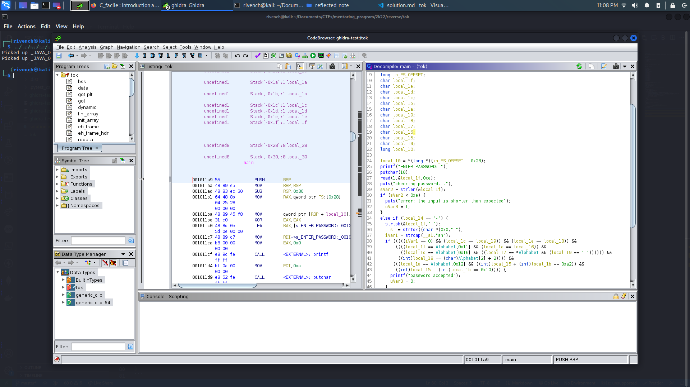

# tok

## Description

> Now, I added some operations ! See if you can retrieve the key. The flag format is : shellmates{key}

## Write-Up

This challenge provides as an attachment a binary to execute. After executing his binary, we notice that it takes an input, and verifies if it is actually the secret key or not :

```
└─$ ./tok
ENTER PASSWORD:
shellmates
checking password...
error: the input is shorter than expected

└─$ ./tok
ENTER PASSWORD: 
shellmatesshel
checking password...
wrong password try again
```

Unfortunatly, we have no more information about this binary, so let's try to open it with `ghidra` and see what it hides :




Here is the code we found :

```c
undefined8 main(void)

{
  int iVar1;
  size_t sVar2;
  undefined8 uVar3;
  char *__s1;
  long in_FS_OFFSET;
  char local_1f;
  char local_1e;
  char local_1d;
  char local_1c;
  char local_1b;
  char local_1a;
  char local_19;
  char local_18;
  char local_17;
  char local_16;
  char local_15;
  char local_14;
  long local_10;
  
  local_10 = *(long *)(in_FS_OFFSET + 0x28);
  printf("ENTER PASSWORD: ");
  putchar(10);
  read(1,&local_1f,0xe);
  puts("checking password...");
  sVar2 = strlen(&local_1f);
  if (sVar2 < 0xe) {
    puts("error: the input is shorter than expected");
    uVar3 = 1;
  }
  else if (local_14 == '-') {
    strtok(&local_1f,"-");
    __s1 = strtok((char *)0x0,"-");
    iVar1 = strcmp(__s1,"sh");
    if (((((iVar1 == 0) && (local_1c == local_19)) && (local_1e == local_18)) &&
        ((((local_1f == Alphabet[0x11] && (local_1a == local_16)) &&
          ((local_1d == Alphabet[0x16] && ((local_17 == *Alphabet && (local_19 == '_')))))) &&
         ((int)local_18 == (char)Alphabet[2] + 2)))) &&
       (((local_1a == Alphabet[0x12] && ((int)local_15 + (int)local_1b == 0xa2)) &&
        ((int)local_15 - (int)local_1b == 0x10)))) {
      printf("password accepted");
      uVar3 = 0;
    }
    else {
      puts("wrong password try again");
      uVar3 = 0;
    }
  }
  else {
    puts("wrong password try again");
    uVar3 = 1;
  }
  if (local_10 != *(long *)(in_FS_OFFSET + 0x28)) {
                    /* WARNING: Subroutine does not return */
    __stack_chk_fail();
  }
  return uVar3;
}
```

We can see from the following code that the length of the password is actually `0xe` :

```c
...
  sVar2 = strlen(&local_1f);
  if (sVar2 < 0xe) {
    puts("error: the input is shorter than expected");
    uVar3 = 1;
  }
...
```

Where `local_1f` is actually our string input.

So we need to adjust the input variable type (from `char` to `char [0xe]`) to have a coherent code, here is what we get :

```c
/* WARNING: Unknown calling convention yet parameter storage is locked */

int main(void)

{
  long lVar1;
  int iVar2;
  size_t sVar3;
  char *__s1;
  long in_FS_OFFSET;
  char input [14];
  
  lVar1 = *(long *)(in_FS_OFFSET + 0x28);
  printf("ENTER PASSWORD: ");
  putchar(10);
  read(1,input,0xe);
  puts("checking password...");
  sVar3 = strlen(input);
  if (sVar3 < 0xe) {
    puts("error: the input is shorter than expected");
    iVar2 = 1;
  }
  else if (input[11] == '-') {
    strtok(input,"-");
    __s1 = strtok((char *)0x0,"-");
    iVar2 = strcmp(__s1,"sh");
    if (((((iVar2 == 0) && (input[3] == input[6])) && (input[1] == input[7])) &&
        ((((input[0] == Alphabet[0x11] && (input[5] == input[9])) &&
          ((input[2] == Alphabet[0x16] && ((input[8] == *Alphabet && (input[6] == '_')))))) &&
         ((int)input[7] == (char)Alphabet[2] + 2)))) &&
       (((input[5] == Alphabet[0x12] && ((int)input[10] + (int)input[4] == 0xa2)) &&
        ((int)input[10] - (int)input[4] == 0x10)))) {
      printf("password accepted");
      iVar2 = 0;
    }
    else {
      puts("wrong password try again");
      iVar2 = 0;
    }
  }
  else {
    puts("wrong password try again");
    iVar2 = 1;
  }
  if (lVar1 != *(long *)(in_FS_OFFSET + 0x28)) {
                    /* WARNING: Subroutine does not return */
    __stack_chk_fail();
  }
  return iVar2;
}
```

In order to recover the key, here is the code we should follow :

```c
...
  else if (input[11] == '-') {
    strtok(input,"-");
    __s1 = strtok((char *)0x0,"-");
    iVar2 = strcmp(__s1,"sh");
    if (((((iVar2 == 0) && (input[3] == input[6])) && (input[1] == input[7])) &&
        ((((input[0] == Alphabet[0x11] && (input[5] == input[9])) &&
          ((input[2] == Alphabet[0x16] && ((input[8] == *Alphabet && (input[6] == '_')))))) &&
         ((int)input[7] == (char)Alphabet[2] + 2)))) &&
       (((input[5] == Alphabet[0x12] && ((int)input[10] + (int)input[4] == 0xa2)) &&
        ((int)input[10] - (int)input[4] == 0x10)))) {
      printf("password accepted");
      iVar2 = 0;
    }
...
```

Where the `Alphabet` string (which is probably a const, we can find it in the labels section of ghidra symbols tree) contains the following :

```
ABCDEFGHIJKLMNOPQRSTUNVWXYZ
```

And from that, we get the following assetions :

 - The key is `0xe` bytes long, i.e **14 bytes or chars long**.
 - 12th char is a `-`
 - 4th char equals 7th char.
 - 2nd char equals 8th char.
 - 1st char is a `R`
 - 6th char equals 10th char.
 - 3rh char is a `V`
 - 9th char is an `A`
 - 7th char is a `_`
 - 8th char ASCII number is `67 + 2 = 69`, so it is a `E` (the `67` is from the `C` ASCII number, which is the 3rd is the Alphabet chars)
 - 6th char is as `S`
 - To extract 5th and 11th chars, we get to solve the following equation :

```c
(int)input[10] + (int)input[4] == 0xa2
(int)input[10] - (int)input[4] == 0x10
```

where :

```py
In [6]: 0xa2
Out[6]: 162

In [7]: 0x10
Out[7]: 16
```


Which gives us : 11th char ASCII number is `89` and 5th char ASCII number is `73`, which gives us :

```py
In [15]: chr(89)
Out[15]: 'Y'

In [16]: chr(73)
Out[16]: 'I'
```

 - 11th char is a `Y`
 - 5th char is a `I`
 - We have also this code :

```c
...
  else if (input[11] == '-') {
    strtok(input,"-");
    __s1 = strtok((char *)0x0,"-");
    iVar2 = strcmp(__s1,"sh");
...
```

And since 12th is a `-`, so the we get that :
 - 13th char is a `s`
 - 14th char is a `h`


From there, we construct the key :

```
REV_IS_EASY-sh
```

## Flag

shellmates{REV_IS_EASY-sh}

## More Information

 
