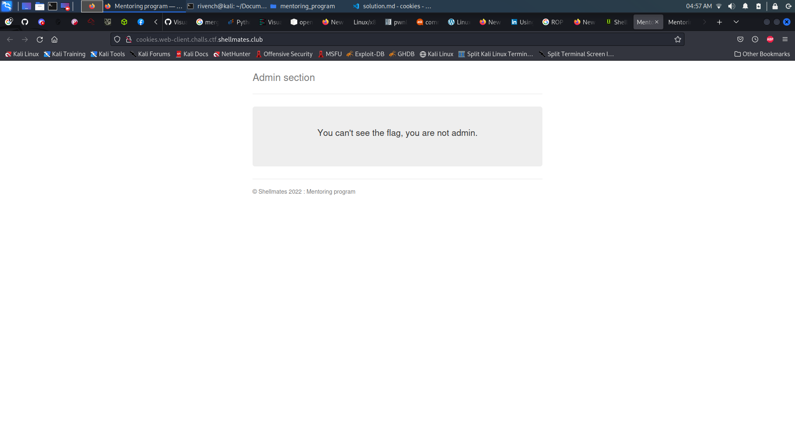
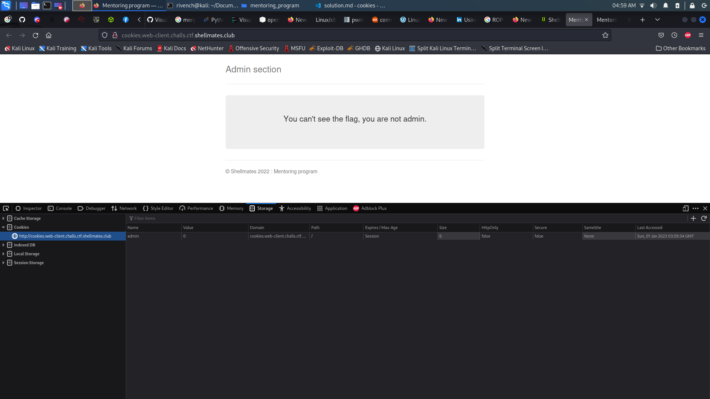
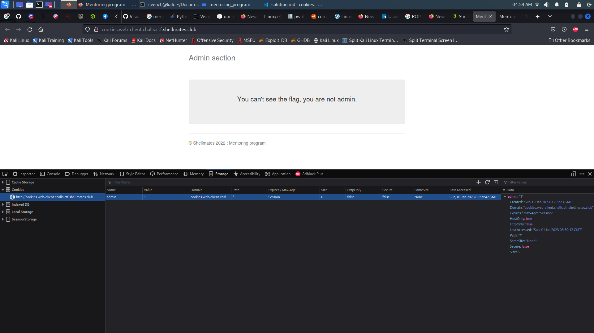
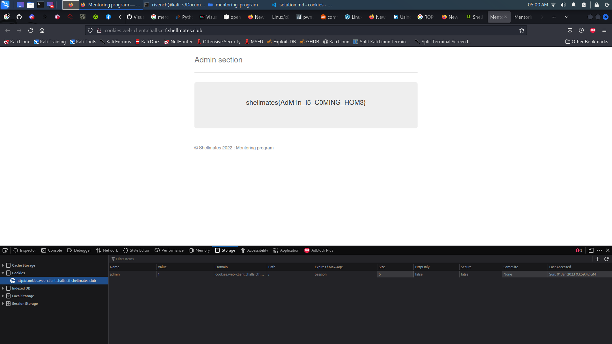

# cookies

## Description

> Can you be admin?

## Write-Up

So when accessing the website, we get a page that says :

```
...
You can't see the flag, you are not admin. 
...
```

<br>
<br>



<br>
<br>

And from title of the challenge, as well as our client side curisoty, let's check local storage and cookies variables. Indded we find an admin cookie :

<br>
<br>



<br>
<br>

And since it has a value of 0, let's change it to 1 (it might be boolean) and see what happens :

<br>
<br>



<br>
<br>

Now, all we have to do is refresh the page and see if we get the flag :

<br>
<br>



<br>
<br>

## Flag

shellmates{AdM1n_I5_C0MING_HOM3}